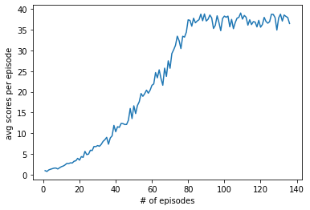
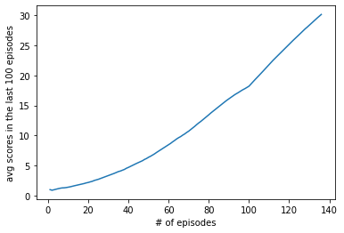

# Report

## Abstract

We report on the project for the continuous control solved using the algorithm of Deep Deterministic Policy Gradient (DDPG) to train multiple agents.

#### *Prerequisites*

For prerequisites, it may be helpful to refer to [DDPG paper](https://arxiv.org/abs/1509.02971). In particular, the sections 3 and 7 therein should be practical.

## Set-up

Suppose that there are double-jointed arms whose hands can move to target positions. Each of 20 agents gains a **reward** of **+0.1** if their hands reach the goal position.

The **state** space is parametrized by **33** variables corresponding to position, rotation, velocity, and angular velocities of the arm. Every **action** forms a vector with **4** components, corresponding to torque applicable to two joints. Each entry in the action vector should be valued in **[-1, 1]**.

## Goal

Our goal for this task that the agents maintain their hands at the target locations for as many time steps as possibl. To solve the environment, the agents must get an average score of +30 over 100 consecutive episodes. Such an average scores is computed as follows:

- After each episode, we collect the sum of rewards gained by each agent  (without discounting), so that we find a score for each agent: 20 (potentially) different scores.
- Then the average of these 20 scores is evaluated. This leads to an average score for each episode, where the average is computed over all 20 agents.

## Learning Algorithm

Here we give a brief summary of essential constituents in our algorithm. Then we present the structure of our neural networks.

### - Actor-Critic Method

Given an system of reinforment learning, an agent takes actions and interacts with an environment. In our notebook, we use a so-called *Actor-Critic* method that consists of the following two different roles:

1. **Actor**:
   Given a state $s$, the agent selects an action $a$ recommended according to some policy as $a = \pi(s)$.
2. **Critic**:
   The agent estimates the expected rewards in the future and then evaluating the policy.

In the implementation, both the actor and the critic are played by two distinguished neural networks. More details on the architecture of the whole network will be introduced below.

### - DDPG

In this project of our interest, our focus is on the implementation of **Deep Deterministic Policy Gradient** (DDPG). The latter is a class of the off-policy Actor-Critic methods. The structure of the DDPG is a combination of Deep Q-learning (DQN) and the Deterministic Policy Gradient. First, there are two separate neural networks that trains the agents. On one side, the actor and the critic models. On one side, the actor network selects an action based on the approximation by its neural network with some weights deterministically. On the other hand, like the Q-learning process, the critic network takes a state-action pair $(s,a)$ to return the Q-value $Q(s,a)$ with some weights.

Note that like in the DQN, the DDPG is equipped with the **replay buffer**. Also, we have both local(or regular), and target networks for the actor and critic models, respectively. The local networks are used for the training while the target networks for the prediction to stabilize the training . The weights of the target networks are optimized using the **soft update** strategy. The latter get the trained weights of the local networks slowly copied to the those of the target ones, say, 10 times every 20 time step. It is known to yield a faster convergence.

For optimization, when updating the critic model, we evaluate the mean-squared-error (mse) of the Q-values from both the regular and target networks at a time step $t$. When the episode continues to the next time step $t+1$, the target critic returns
$$
r_{t} + \gamma \ast Q(s_{t+1}, a_{t+1} = \pi(s_{t+1})),
$$
where $r_{t}$ is a reward, $\gamma$ is a discount factor, and all the weights involved in $\pi$ and $Q$ are from the target networks. If the episode ends at $t$, the second term is truncated.
Moreover, the weights of the actor are updated in such a way that the actor selects a suitable action to make the mean of Q-values from the local critic **bigger** (Be careful with an extra minus sign! in the actor's loss!).

#### Remarks

We blended states with some noises using the Ornstein-Uhlenbeck process for efficiency of learning (See [`here`](https://en.wikipedia.org/wiki/Ornstein%E2%80%93Uhlenbeck_process), for instance. Conventions for the parameters are given.). Also, in the training process of the critic model, the gradient clipping was used, so that the gradient was truncated up to 1.

### - Structure of neural networks

Our neural networks used for the actor and critic models are a combination of fully connected layers and ReLu activation functions.

- The actor model has three dense layers between which two ReLu functions are inserted. Finally, the output is given through the tanh activation.
- The critic model starts from a linear layer, followed by the ReLu activation. Then we concatenate the output with the action chosen by the actor. Then we act the fully-connected layer, ReLu activation, and then the last linear layer to get the Q-value.

#### Remarks

In the notebook `model.py`, we prepared layers for the Batch normalization but did not use them, because the results became worse.

### - Hyperparameters

Finally, we collected the following set of hyperparameters for our model below. Note that the random seeds are not given here.

```
- BUFFER_SIZE = 100000 # the size of the replay memory
- BATCH_SIZE = 256 # batch size
- GAMMA = 0.99  # discount factor
- hidden units = 128 # number of nodes in the linear layers in the actor and critic models.

# For learning process
- LR_ACTOR = 0.0025  # learning rate for actor model
- LR_CRITIC = 0.001 # learning rate for critic model
- WEIGHT_DECAY_ACTOR = 0  # weight decay for the actor
- WEIGHT_DECAY_CRITIC = 0 # weight decay for the critic

# For soft update
- LEARN_EVERY = 20 # time steps for soft update per which learning occurs 10 times
- TAU = 0.001 # 0.1 % of weights from the local networks are copied.

# For O-U process
- EPSILON = 1.0 # noise factor
- EPSILON_DECAY = 0.999 # noise factor decay
- mu = 0.0
- theta = 0.15
- sigma = 0.1

# For implementation
- the preset number of episodes = 1000
- threshold = 30 # required scores to solve the environment
```

We assigned different learning rates to the actor and critic networks. We choose both learning rates to be the same, but the results became much worse.

## Results

Using the networks and hyperparameters in the previous section, we present the results of the performance of our model with 20 agents. The environment was solved within 1000 episodes and indeed only in 136 episodes. The cummulative average scores/per all the agents and 100 episodes are given as follows:

```
Device used:  cpu
Episode 10: 	Avg score (over last 100 EPs): 1.369	Elapsed time: 77.79
Episode 20: 	Avg score (over last 100 EPs): 2.157	Elapsed time: 90.84
Episode 30: 	Avg score (over last 100 EPs): 3.312	Elapsed time: 97.80
Episode 40: 	Avg score (over last 100 EPs): 4.671	Elapsed time: 96.66
Episode 50: 	Avg score (over last 100 EPs): 6.361	Elapsed time: 109.40
Episode 60: 	Avg score (over last 100 EPs): 8.455	Elapsed time: 107.93
Episode 70: 	Avg score (over last 100 EPs): 10.715	Elapsed time: 78.68
Episode 80: 	Avg score (over last 100 EPs): 13.444	Elapsed time: 79.37
Episode 90: 	Avg score (over last 100 EPs): 16.107	Elapsed time: 87.72
Episode 100: 	Avg score (over last 100 EPs): 18.209	Elapsed time: 86.13
Episode 110: 	Avg score (over last 100 EPs): 21.812	Elapsed time: 90.25
Episode 120: 	Avg score (over last 100 EPs): 25.205	Elapsed time: 91.70
Episode 130: 	Avg score (over last 100 EPs): 28.374	Elapsed time: 90.08

Environment solved in 36 EPs!
Avg Score (over last 100 EPs): 30.18
```

The average scores over 20 agents per episode in the whole history are given in the following figure. It turned out that the average scores per episode satisfied the requirement to solve the environment within less than 80 episodes.



Moreover, the increase of the cummulative average scores in the deque list (size: 100) is dipicted below.



We see that the cummulative average scores increased almost monotonically, and the improvement of the learning process went well. The weights of the trained actor and critic models are saved as `check_point_actor.pth` and `check_point_critic.pth`.

## Conclusions

In this project of the continuous control, we constructed a model that involves the DDPG method. As such, the environment was solved after 136 episodes. 

Let us make a few comments on the possibilities of the model building. In a task to gather experiences by using multiple agents, it will be interesting to use other algorithms, such as [PPO](https://arxiv.org/pdf/1707.06347.pdf), [A3C](https://arxiv.org/pdf/1602.01783.pdf), and [D4PG](https://openreview.net/pdf?id=SyZipzbCb), which also involve non-interacting copies of the same agent. 

As for the hyper parameters, we got a better result just by choosing different random seeds, which is not clearly understood. It would be interesting to understand to what extent the choice of such random values and possibly the initialization of weights affect the final reults.

We might come back to these issues elsewhere.